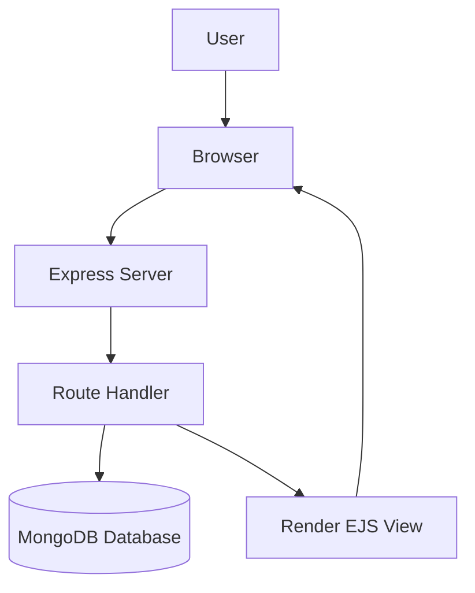

<p align="center">
  
</p>

<h1 align="center">Mini WhatsApp</h1>

<p align="center"><i>A lightweight, full-stack chat application that mimics basic WhatsApp-style messaging.</i></p>

<p align="center">
  
  
  
  
  
  
</p>


## Table of Contents

- [🚀 Project Intro](#-project-intro)
- [📁 Project Structure](#-project-structure)
- [✨ Features](#-features)
- [🧰 Tech Stack](#-tech-stack)
- [⚙️ Installation](#️-installation)
- [🔐 Environment Variables](#-environment-variables)
- [▶️ Running the App](#️-running-the-app)
- [🤝 Contributing](#-contributing)
- [📄 License](#-license)

## 🚀 Project Intro

Mini WhatsApp is a small Express-based web app built for managing chat messages in a simple CRUD flow. It uses EJS templates for the UI, Bootstrap for styling, and MongoDB for persistent storage.

The application is organized around a basic chat list experience where users can:

- view all saved chats
- create a new chat entry
- edit an existing message
- delete a chat entry

## 📁 Project Structure

```txt
mini-whatsapp/
├── index.js
├── init.js
├── package.json
├── ExpressError.js
├── models/
│   └── chat.js
├── public/
│   ├── edit.css
│   ├── form.css
│   └── style.css
└── views/
    ├── edit.ejs
    ├── form.ejs
    └── index.ejs
```

## 🔧 Features

| Feature | Status | Description |
| --- | --- | --- |
| Chat Listing | ✅ Implemented | Browse all chat records from the home page |
| Create Chat | ✅ Implemented | Add a new chat through a simple form-based interface |
| Edit Chat | ✅ Implemented | Update the content of an existing message |
| Delete Chat | ✅ Implemented | Remove a chat from the list when it is no longer needed |
| Persistent Storage | ✅ Implemented | Save and retrieve chat data with MongoDB and Mongoose |
| Error Handling | ✅ Implemented | Gracefully respond to missing chats and invalid routes |
| Friendly UI | ✅ Implemented | Display the app using EJS templates and Bootstrap styling |

### Main Routes

- `/` → redirects to `/chats`
- `/chats` → displays all chats
- `/chats/new` → form to create a new chat
- `/chats/:id` → view/edit chat details
- `/chats/:id/edit` → edit chat form

### 🔄 Application Flow



## 🧰 Tech Stack

- **Backend:** Node.js + Express.js
- **Frontend:** EJS, HTML, CSS, Bootstrap, and JavaScript
- **Database:** MongoDB with Mongoose
- **Tooling:** dotenv, method-override, and npm

## ⚙️ Installation

1. Clone the repository:

```bash
git clone <your-repo-url>
cd mini-whatsapp
```

2. Install dependencies:

```bash
npm install
```

3. Create a `.env` file in the project root and set your MongoDB connection string:

```env
ATLASDB_URL=your_mongodb_connection_string
```

4. Optional: seed sample chat data:

```bash
node init.js
```

## 🔐 Environment Variables

Create a `.env` file in the project root:

```env
ATLASDB_URL=your_mongodb_connection_string
NODE_ENV=development
```

Notes:

- `ATLASDB_URL` is required for connecting to MongoDB.
- `NODE_ENV` is optional, but when it is not set to `production`, the app loads variables from `.env` using dotenv.

## ▶️ Running the App

Start the server:

```bash
node index.js
```

Then open:

```text
http://localhost:3000
```

## 🤝 Contributing

Contributions are welcome. If you would like to improve the app, please open an issue or submit a pull request with a clear description of the change.

## 📄 License

This project is licensed under the ISC License.
